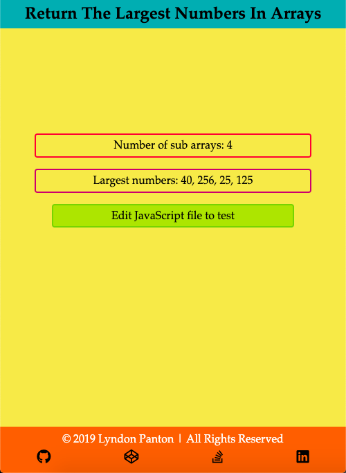
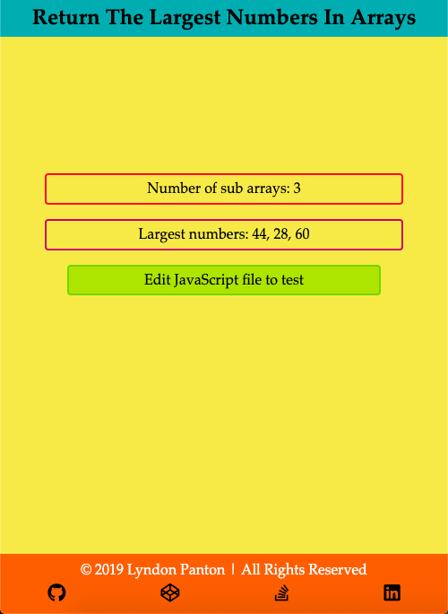

# Return The Largest Numbers In Arrays

## How To Open
> 1. Go to the project's download folder
> 2. Right click on the file named _index.html_
> 3. Choose the _open with_ option
> 4. Open the application in your desired browser

## How To Use
> 1. Open the JavaScript file in your desired editor
> 2. Edit the sub arrays in the _arr_ variable with numbers of your choice or add more sub array with numbers
> 3. Refresh the browser
> 4. The amount of sub arrays and largest number in each sub array will be displayed

## Requirements
> 1. This project requires a browser to run
> 2. The browser must have JavaScript available and enabled

## Extra Information
> 1. This was done for one of freecodecamp's Basic Algorithm Scripting activities

## Preview

**Thank you for taking a look at this project**